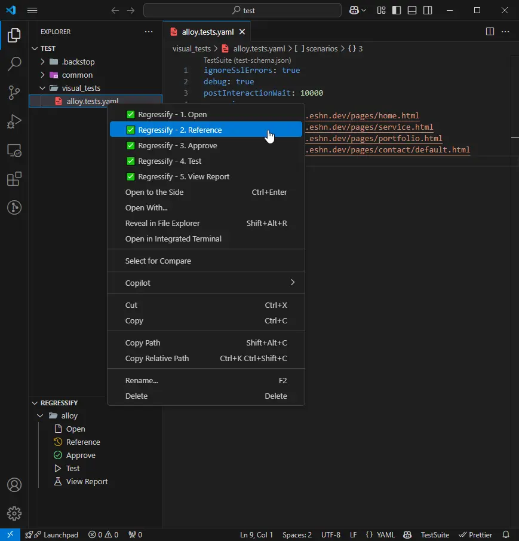
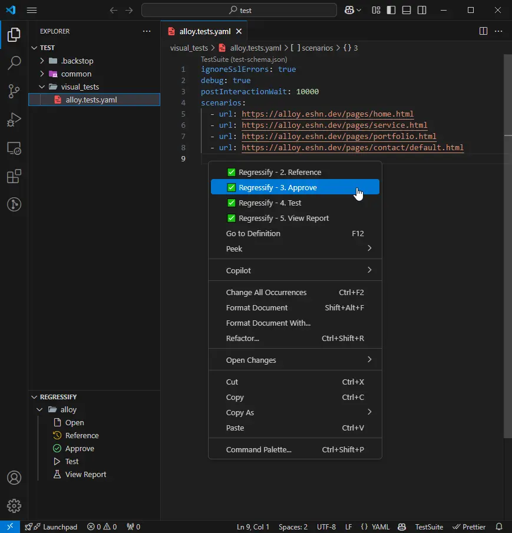
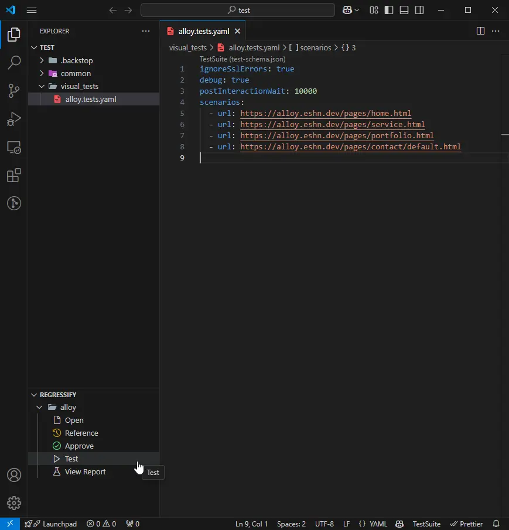

# README

Extension for Regressify Visual Automation Regression Testing Tool.

Provide helpful features for Regressify.

Please check [Documentation](https://tuyen.blog/optimizely-cms/testing/get-started/) for the instructions.

## Features

Add Explorer Context:

Add Editor Context:

Add Regressify Panel:

